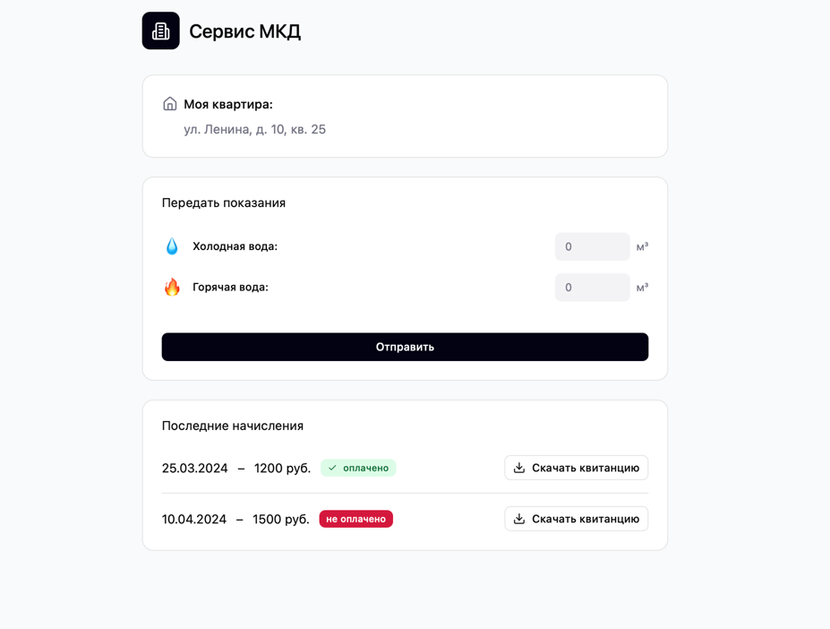
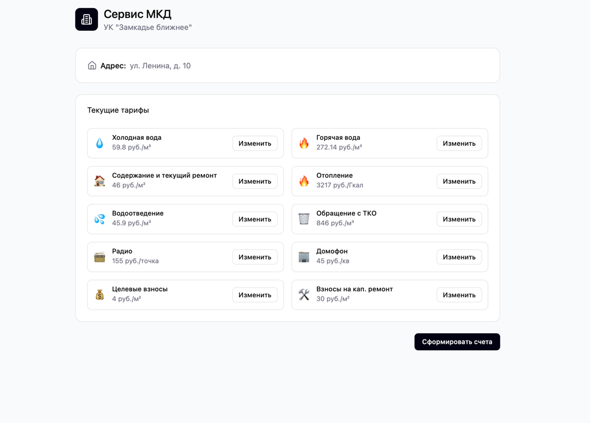

# 202505-ok-mkdservice

Mkdservice - сервис для жителей многоквартирного дома (МКД). Задача сервиса для жителей МКД - предоставить единую платформу для решения типичных проблем. Задача сервиса для управляющей компании (УК) - предоставить единую платформу для взаимодействия между жителями МКД и компаниями, отвечающими за обслуживание дома.

## MVP

Mkdservice - веб-приложение (с логикой на бекенде) для жителей многоквартирного дома (МКД), которое позволяет передавать показания счетчиков воды и автоматически формировать счета на оплату ЖКХ, а также дает управляющей компании (УК) возможность настраивать тарифы. 

## Документация

1. Маркетинг и аналитика
   1. [Целевая аудитория](./docs/01-biz/01-target-audience.md)
2. Архитектура
   1. [API](./docs/02-architecture/01-api.md)
3. DevOps
   1. [Файлы сборки](./deploy)

## Визуальная схема фронтенда

### Плагины Gradle сборки проекта

1. [build-plugin](build-plugin) Модуль с плагинами
2. [BuildPluginJvm](build-plugin/src/main/kotlin/BuildPluginJvm.kt) Плагин для сборки проектов JVM
2. [BuildPluginMultiplarform](build-plugin/src/main/kotlin/BuildPluginMultiplatform.kt) Плагин для сборки
   мультиплатформенных проектов

## Проектные модули

## Мониторинг и логирование

1. [deploy](deploy) - Инструменты мониторинга и деплоя
2. [mkdservice-lib-logging-common](mkdservice-libs/mkdservice-lib-logging-common) - Общие объявления для
   логирования
3. [mkdservice-lib-logging-kermit](mkdservice-libs/mkdservice-lib-logging-kermit) - Библиотека логирования
   на базе библиотеки Kermit

### Транспортные модели, API

1. [specs](specs) - описание API в форме OpenAPI-спецификаций
2. [mkdservice-api-v2-kmp](mkdservice-be/mkdservice-api-v1-kmp) - Генерация транспортных
   моделей с KMP
3. [mkdservice-common](mkdservice/mkdservice-common) - модуль с общими классами для модулей проекта. В
   частности, там располагаются внутренние модели и контекст.

### Фреймворки и транспорты

1. [mkdservice-app-ktor](mkdservice-be/mkdservice-app-ktor) - Приложение на Ktor
2. [mkdservice-app-kafka](mkdservice-be/mkdservice-app-kafka) - Микросервис на Kafka

### Модули бизнес-логики

1. [mkdservice-stubs](mkdservice-be/mkdservice-stubs) - Стабы для ответов сервиса
2. [mkdservice-biz](mkdservice-be/mkdservice-biz) - Модуль бизнес-логики приложения: обслуживание стабов,
   валидация, работа с БД

## Тестирование

### Сквозные/интеграционные тесты

1. [mkdservice-e2e-be](mkdservice-tests/mkdservice-e2e-be) - Сквозные/интеграционные тесты для бэкенда
   системы
